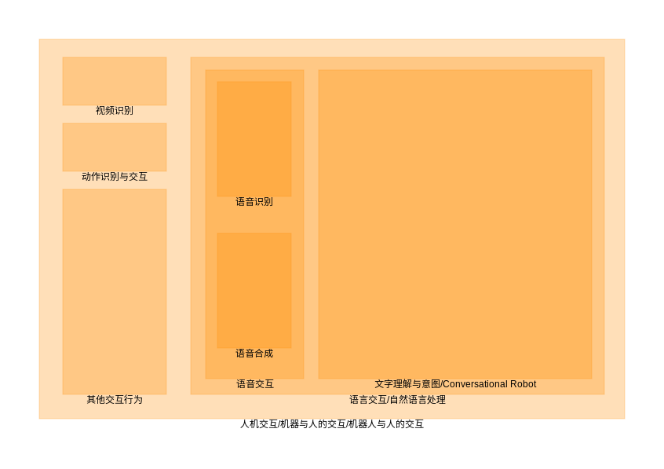
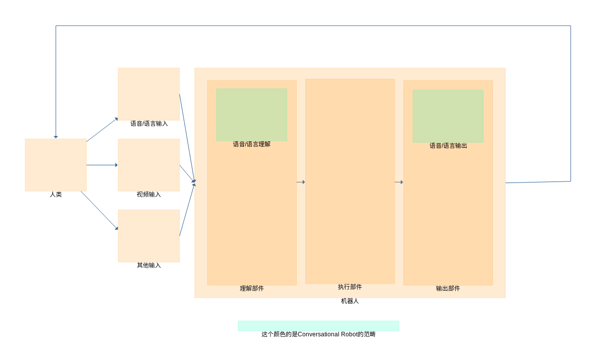
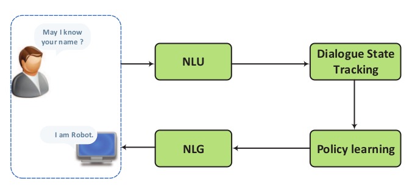
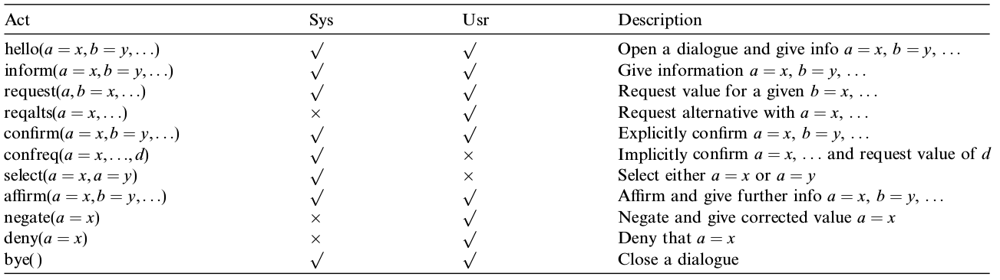

<!-- START doctoc generated TOC please keep comment here to allow auto update -->
<!-- DON'T EDIT THIS SECTION, INSTEAD RE-RUN doctoc TO UPDATE -->
**Table of Contents**  *generated with [DocToc](https://github.com/thlorenz/doctoc)*

- [导论：什么是我所说的 Conversational Robot](#%E5%AF%BC%E8%AE%BA%E4%BB%80%E4%B9%88%E6%98%AF%E6%88%91%E6%89%80%E8%AF%B4%E7%9A%84-conversational-robot)
  - [Conversational Robot 的来历](#conversational-robot-%E7%9A%84%E6%9D%A5%E5%8E%86)
  - [简单的来说](#%E7%AE%80%E5%8D%95%E7%9A%84%E6%9D%A5%E8%AF%B4)
  - [从人机交互的角度看Conversational Robot](#%E4%BB%8E%E4%BA%BA%E6%9C%BA%E4%BA%A4%E4%BA%92%E7%9A%84%E8%A7%92%E5%BA%A6%E7%9C%8Bconversational-robot)
  - [从机器人的角度来看Conversational Robot](#%E4%BB%8E%E6%9C%BA%E5%99%A8%E4%BA%BA%E7%9A%84%E8%A7%92%E5%BA%A6%E6%9D%A5%E7%9C%8Bconversational-robot)
  - [内部组件，从Dialogue System的主要骨架说起](#%E5%86%85%E9%83%A8%E7%BB%84%E4%BB%B6%E4%BB%8Edialogue-system%E7%9A%84%E4%B8%BB%E8%A6%81%E9%AA%A8%E6%9E%B6%E8%AF%B4%E8%B5%B7)
    - [语音识别（ASR）](#%E8%AF%AD%E9%9F%B3%E8%AF%86%E5%88%ABasr)
    - [自然语言理解（NLU or SLU or LU）](#%E8%87%AA%E7%84%B6%E8%AF%AD%E8%A8%80%E7%90%86%E8%A7%A3nlu-or-slu-or-lu)
    - [Dialogue State Tracker & Dialogue Policy](#dialogue-state-tracker--dialogue-policy)
    - [自然语言生成 NLG](#%E8%87%AA%E7%84%B6%E8%AF%AD%E8%A8%80%E7%94%9F%E6%88%90-nlg)
    - [语音合成 TTS](#%E8%AF%AD%E9%9F%B3%E5%90%88%E6%88%90-tts)
  - [问答系统 QA System](#%E9%97%AE%E7%AD%94%E7%B3%BB%E7%BB%9F-qa-system)
    - [问答匹配 Question & Answer Selection/Matching/Searching](#%E9%97%AE%E7%AD%94%E5%8C%B9%E9%85%8D-question--answer-selectionmatchingsearching)
    - [IR-based](#ir-based)
    - [Knowledge-based](#knowledge-based)
  - [Chatbot](#chatbot)
    - [template-based](#template-based)
    - [neural-based](#neural-based)

<!-- END doctoc generated TOC please keep comment here to allow auto update -->


# 导论：什么是我所说的 Conversational Robot

包括 Dialogue System, QA System, Chatbot 简述。
下面大部分文字是整体的介绍，当然要完全把这三个部分都详细说完，可能就够一本书了，没几百篇论文的阅读出不来。
主要是因为每个系统的每个实现方法经常都是独立的一个领域，而很少有介绍完整成品的东西，也几乎没有完整的书籍。

## Conversational Robot 的来历

主要是为了避免dialogue和chat这两个词。

Dialogue System 和 Chatbot 都有其比较特定的含义，这里避开他们。
然后使用了 Conversational 这个词。


## 简单的来说

我所定义的

Conversational Robot = Dialogue System + QA System + Chabot + Other Needed Support Components

其中Dialogue System是骨架，其他部分是血肉

其实单独来说，每个系统都可以独立存在。
例如一般的百科全书，如果不严格的讨论，我们可以认为它是一个QA System。
它本身是很有用的，也可以独立存在。

甚至说Chatbot本身，如果应用在心理辅导、婴幼儿陪伴等领域，也可以单独的作为一个应用。

而我之所以把Dialogue System作为主要部分，主要是因为我认为机器人存在的目标最主要是完成任务，我认为传统意义上的Dialogue System，本质就是一个Task-Oriented System。这符合我对于 Robot 的哲学理解，即执行任务是第一要务。

## 从人机交互的角度看Conversational Robot



人与机器有很多交互方式，而语音、语言交互是一项重要的交互方式。

自然语言理解（NLP）包括了语音识别，语音合成，文本理解，文本生成等等范畴，可以说从人机交互的角度来说，Conversational Robot 在这里特指语言的理解、生成这一过程的相关部件。

## 从机器人的角度来看Conversational Robot



从机器人的角度来讲，一个智能体（Intelligent Agent），从外界环境接受信息，这个信息主要的一个信息来源就是人。
而人能提供例如语音（说话），语言（微信打字），视频（机器视觉），动作（动作、手势识别）等信息。

Conversational Robot 特指接受语言，或者经过转换的语音数据，根据对文本的理解，产生一些执行操作。
执行操作可以由其他部件完成。最终把执行结果返回给人的这一个过程的相关部件。


## 内部组件，从Dialogue System的主要骨架说起

一个传统的Dialogue System如下图所示


(Jason D. Williams, The Dialog State Tracking Challenge Series: A Review, 2016)

一个更简单的图例如：



(Hongshen Chen, A Survey on Dialogue Systems:Recent Advances and New Frontiers, 2017)


### 语音识别（ASR）

图中ASR负责识别语音，对于一条用户的语音输入可能有多个结果

例如不同识别到的文本和对应的可信度

例如用户说（注意是语音）：“我要去上海”

结果可能是

```
[
    {
        "sentence": "我要去上海",
        "score": 0.4
    },
    {
        "sentence": "我要去商海",
        "score": 0.3
    },
    {
        "sentence": "我要去伤害",
        "score": 0.1
    }
]
```

实际上很多关于对话系统的文章都没有仔细说这部分，这也是显而易见的，因为语音识别有更专门的领域专家去研究。绝大部分系统的假设都是能拿到比较准确的识别结果，至少是像上面那样的的结果列表，之后的工作。类似的，图中的TTS也是一般被忽略。

### 自然语言理解（NLU or SLU or LU）

这部分在有些资料被称为`SLU`(Spoken Language Understanding)，
有的资料也称为`NLU`(Natual Language Understanding)，甚至`LU`(Language Understanding)。
也有一些文献称之为`Semantic Decoding`，因为它的结果也被称为`Semantic Frame`，
也就是把用户输入的句子（utterance）转换为了一种Semantic Frame，即抽象出了用户所期望行为的语义。

这部分主要根据语音输入的结果，判断用户意图。

从含义角度来说，输出的是，三个部分内容：

SLOT(S): 问题所需要的数据参数

INTENT: 用户意图

DOMAIN: 问题领域

如(Yun-Nung Chen, SYNTAX OR SEMANTICS? KNOWLEDGE-GUIDED JOINT SEMANTIC FRAME PARSING)的例子：

```
W: tell vivian to be quiet
S: contact=vivian, message=be quiet
D: communication
I: send_text
```

也就是用户输入了`tell vivian to be quiet`之后，
或者这句话的DOMAIN（D）是`communication`，
INTENT是`send_text`，
有两个slot，
分别是联系人`contact=vivian`还有信息内容`message=be quiet`

这些内容会被后续的部件处理。


---

从一些实际应用的角度来说，这部分LU在一些系统里也被描述为会产生潜在的`user-action`列表。也就是“用户想做什么”的行为列表和每种行为的可能性

例如用户输入：“明天晚上的电影”，结果可能是

```
[
    {
        "user_action": "request(movie_name, date=tomorrow_night)",
        "score": 0.5
    },
    {
        "user_action": "request(movie_name, date=tomorrow)",
        "score": 0.3
    },
    {
        "user_action": "inform(date=tomorrow_night)",
        "score": 0.1
    }
]
```

这些列表可能类似下面的行为，其中`Usr`列打对号的就是用户可能产生的行为列表，我们以后会在单独的`NLU`相关章节详细探讨这部分内容。
(Steve Young, The Hidden Information State model: A practical framework for POMDP-based spoken dialogue management, 2010)



关于这个列表的详细意义与探讨，会在后续的章节进行。

### Dialogue State Tracker & Dialogue Policy

在某些系统上，这两部分是分离的，在而在很多系统上，实际就是一个部分。也有一些资料把这部分称为Dialogue Management。这部分也被称为Belief Tracking & Policy Optimization / Policy Learning。

需要状态管理是因为对话并不仅仅是单轮的，而是需要多轮进行，或者说完成一个任务很可能需要跟用户反复交互。用户很可能修改之前的意图、提供的参数等等内容。如果对话只是一问一答，即当前问题和以前的问题、回答都没关系的话，那实际上就不算Dialogue System，而是QA System了（Question & Answer）

系统需要保存之前用户的问题，也要保存自己回答的结果，例如：

request的格式：`request(a, b=x, c=y,...)`
即请求参数`a`，并且提供（可选的）参数`b=x`等。

inform的格式：`inform(a=x, b=y)`
即提供信息，用户可以向系统提供信息，系统也可以向用户提供信息（答案或查询结果）。

举例如下：

```
用户：我想找北京去上海的火车

-> user_action: request(车票列表, 起始地=北京, 目的地=上海)
-> sys_action: inform(车票列表=执行部件的答案, 起始地=北京, 目的地=上海)

系统回答实例：从北京去上海的车票有xx趟，如下：xxxxx

用户：从杭州去的呢？

-> user_action: request(车票列表, 起始地=杭州)
-> sys_action: inform(车票列表=执行部件的答案, 起始地=杭州, 目的地=上海)

系统回答示例：从杭州去上海的车票有yy趟，如下：yyyyy
```

假设上面两条是连续的问题，那么系统在回答第二条的时候，用户是没直接提示目的地的（这里是符合自然语言习惯的），那么目的地这个状态，就应该由DST部件存储下来（相当于机器的短期记忆），在一定假设下，补全并猜测到用户的完整意图。

在第二次回答中，如果系统并不确定目的地是上海（例如根据某个概率值），那么可能就会产生下面的情况：


```
用户：我想找北京去上海的火车

-> user_action: request(车票列表, 起始地=北京, 目的地=上海)
-> sys_action: inform(车票列表=执行部件的答案, 起始地=北京, 目的地=上海)

系统回答实例：从北京去上海的车票有xx趟，如下：xxxxx

## 以上部分和上面的例子一样

用户：从杭州去的呢？

-> user_action: request(车票列表, 起始地=杭州)
-> sys_action: confirm(起始地=杭州，目的地=上海)

## confirm是确认操作，期待用户回答诸如是/否，yes/no的回答

系统回答示例：您是说从杭州去上海的车票吗？

用户：是的

-> user_action: confirm()
-> sys_action: inform(车票列表=执行部件的答案, 起始地=杭州, 目的地=上海)

系统回答示例：从杭州去上海的车票有yy趟，如下：yyyyy
```

或者如果系统实在不确定，或者比较愚蠢，甚至可能是：


```
用户：我想找北京去上海的火车

-> user_action: request(车票列表, 起始地=北京, 目的地=上海)
-> sys_action: inform(车票列表=执行部件的答案, 起始地=北京, 目的地=上海)

系统回答实例：从北京去上海的车票有xx趟，如下：xxxxx

## 以上部分和上面的例子一样

用户：从杭州去的呢？

-> user_action: request(车票列表, 起始地=杭州)
-> sys_action: request(目的地=上海)

## 上面最后一行代表，机器也可以向用户请求信息

系统回答示例：请告诉我目的地是哪里？

用户：是上海

-> user_action: inform(目的地=上海)
-> sys_action: inform(车票列表=执行部件的答案, 起始地=杭州, 目的地=上海)

系统回答示例：从杭州去上海的车票有yy趟，如下：yyyyy
```

这些不同的操作，最终都成功引导到了结果。当然理论上第一次最好，因为用户操作最少，但是如果ASR部件、NLU部件甚至DST部件产生了错误（例如听错了、理解错误、管理失误等等），那么是有可能产生后两次的对话。

所以DST和DP部件，主要是管理历史状态，并且根据状态生成一个`sys_action`，系统所要应对的行为。

### 自然语言生成 NLG

自然语言生成部件的主要目的是根据系统的相应类型，生成自然语言回答。

一般来说这部分主要是套模板。

当然现在也有一些使用如seq2seq模型等等产生的NLG方法。这些方法的出现一来是为了提高系统的鲁棒性，另一方面是希望系统说话更接近人类说话方式，最终提高用户体验。

### 语音合成 TTS

这部分是指从文字到语音合成的部分，并不在我所定义的Conversational Robot的范畴内。绝大部分Dialogue System或其他相关文献也都会忽略，因为模块本身可以独立运作，并且有比较成熟的解决方案。

## 问答系统 QA System

这里简单探讨QA系统的几种形式

### 问答匹配 Question & Answer Selection/Matching/Searching

假设我们有一堆问答对`(q_1, a_1, q_2, a_2, ..., q_n, a_n)`

如果这个时候新来了一个问题，最朴素的想法就是去这些问答对里面搜索，找到答案（假设有的话）。

问题是，问题本身的形式可能多种多样，例如：

- 你从哪来？
- 你哪来的？
- 你从哪里来？
- 你来自哪里？

这些问题本身都代表一样的含义，或者说他们有相似的语义（Semantic)。

那么问题来了，如何确定答案？

假设我们有一个函数`f(x, y)`，当两个问题相似的时候`f(q_1, q_2)`趋近于1，当两个问题不相似的时候`f(q_1, q_3)`趋近于0。

那么用户只要输入一个新问题`q_user`，那么我们只要从数据库里面计算`argmax{q_i} f(q_i, q_user)`就好了。也就是从数据库中找到与问题`q_user`最相似的问题。

当然还有另一种类似的做法，假设一个函数`g(x, y)`，当一个问题`q`和答案`a`是一对的时候（也就是`a`是`q`的正确答案），那么`g(q, a)`趋近于1，如果不是一对，则趋近于0。

当用户来了新问题`q_user`，那么我们只要遍历数据库里面的所有答案寻找`argmax{a_i} g(q_user, a_i)`，则可以找到，最符合用户问题的答案

---

当然实际应用的时候，我们不可能真的遍历数据库的所有问题（可能有几百万条数据，时间性能不允许），这个时候我们可以通过其他手段。

例如我们有一个函数`vec(x)`，它可以把一个问题或者答案转换成一个有限长度的实数向量。然后我们还有一个函数`similarity(x, y)`，用来判断两个向量是否相似。那么当用户来了一个问题`q_user`的时候，我们可以先把它向量化得到`vec(q_user)`，然后再去匹配我们已经`预先`向量化好的其他问题。
即`argmax{vec(q_i)} similarity(vec(q_user), vec(q_i))`

因为向量相似匹配的算法，可能远快于遍历所有问题（或答案）。（例如用K-neighbour相关算法如BallTree等)

用深度学习解决此类问题的论文比较多，例如：

(Ming Tan, LSTM-BASED DEEPLEARNING MODELS FOR NON-FACTOID ANSWER SELECTION, 2016)

### IR-based

利用搜索引擎，或者类似搜索引擎的技术

假设我们问“爱因斯坦出生于哪一年？”

然后把这个问题直接丢给搜索引擎，或者经过某种转换到某个形式（例如把问题修改为文本“爱因斯坦 出生 年份”）

假设去搜索，第一条结果可能如下：

```
阿尔伯特·爱因斯坦- 维基百科，自由的百科全书
https://zh.wikipedia.org/zh-hant/阿尔伯特·爱因斯坦
阿尔伯特·爱因斯坦，或譯亞伯特·爱因斯坦（德語：Albert Einstein，1879年3月14日－1955年4月18日），猶太裔理論物理學家，创立了現代物理學的兩大支柱之一的相对论 :274，也是質能等價公式（E = mc2）的發現者。他在科學哲學領域頗具影響力。因為“對理論物理的貢獻，特別是發現了光電效應的原理”，他榮獲1921年諾貝爾物理學獎 ...
```

而我们根据问题可以判断用户的意图是希望结果是“哪一年”，也就是问题答案很可能是(18xx年, 19xx年, 18xx-xx-xx, 19xx-xx-xx)之类的形式。

我们获得了潜在的答案类型，和潜在包含答案的数据条目。我们再从中搜索我们的答案。

这个方法的方法与条件：

- 答案比较短（一个词或一个短语）的时候
- 把问题转换为可能更容易搜索到答案的形式
- 猜测用户所希望的答案类型（是人？地点？时间？其他？）


### Knowledge-based

当然也可以说语义网、知识图谱等based

这个角度解决QA问题首先我们需要有一堆数据库，常见使用三元组（triples）的形式保存，例如：

- (爱因斯坦，出生于，1879)
- (爱因斯坦，职业，物理学家)
- (爱因斯坦，死于，1955)
- (中国，首都，北京)
- (美国，首都，华盛顿)

类似这样，一般来说三元组中间那是一个关系（relation），而两边是两个实体（entity），我们也可以写作`出生于(爱因斯坦，1879)`，`出生于(这篇文章的作者，2020)`，类似这样的形式

假设我们有很多这样的三元组数据，那么我们解决：“爱因斯坦出生在哪年”这样的问题方法，是把问题转换为一种逻辑形式，例如：

```
爱因斯坦出生在哪年 => 出生于(爱因斯坦, ?x)
中国的首都 => 首都(中国, ?y)
```

其中`出生于`和`首都`都是关系，而`中国`和`爱因斯坦`都是实体，而`?x`和`?y`都是自由变量，这里代指我们想要寻求的答案。

从这个角度解决QA问题有一套比较完整的方法论，如RDF，Semantic Web，SPARQL等技术和方法

也有一些文献使用了结合deep learning与sequence-to-sequence等技术的的Knowledge-based解决方案，具体内容我们后续会讨论。


## Chatbot

这里Chatbot特指中文的闲聊机器人

闲聊机器人是带有一定“娱乐”意味的机器人。当然也可以用作例如心理辅导，心理帮助，婴幼儿教育，儿童陪伴等等内容。

这部分就不是完成一个任务，不是需要答案，而更多的是陪伴、娱乐、放松。一个Chatbot最简单的成功指标就是，本质是鼓励用户多和Chatbot交流，用户使用时长和用户下次继续使用的意愿，如果用户愿意一直陪着Chatbot聊天，那就成功了。

一般来说Chatbot只有两种技术，template-based和neural-based

### template-based

也就是根据模板来选择回答

最简单的模板例如：

```
用户：你喜欢 * 吗？
系统：我喜欢 * 啊，你喜欢吗？
系统：我喜欢 * 啊，你还喜欢什么别的吗？

用户：你吃过 * 吗？
系统：我是机器人，不吃 *
系统：* 好吃吗？你告诉我呗

用户：你觉得 * 怎么样？
系统：这取决于你对 * 的理解，我不好回答啊
系统：我觉得 * 还不错吧，你怎么看？
```

可以看出，上面模板的`*`可以代指很多东西

当然实际应用上，模板可能比上面复杂的多，可以解决更多问题，设置算术题，计算，递归等等

这方面比较完整的研究是AIML语言，即 Artificial Intelligence Markup Language 语言。

是一种XML格式的标记语言，这部分方法也曾经是试图解决图灵测试的主力研究方法。

更多内容可以参考：

[Wikipedia AIML](https://en.wikipedia.org/wiki/AIML)

[AIML tutorial](https://www.tutorialspoint.com/aiml/index.htm)

### neural-based

是以神经机器翻译模型为参考，用来生成对话的模型。即基于深度学习的 sequence-to-sequence 模型（或变种），来生成对话。

这类模型直接训练对话，得到端到端的结果。训练数据大部分来自于电影字幕、社交媒体，或者其他已有的对话数据。

这方便比较前沿的研究如

(Jiwei Li, Adversarial Learning for Neural Dialogue Generation, 2017)

(Jiwei Li, Deep Reinforcement Learning for Dialogue Generation, 2016)

更多 Template-based 和 Neural-Based 的实现，我们后续张章节会讨论。
