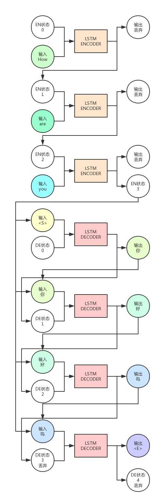

# Sequence to Sequence学习简述

Sequence to Sequence学习最早由Bengio在2014年的[论文](https://arxiv.org/pdf/1406.1078.pdf)中提出。
这篇文章主要是提供了一种崭新的RNN Encoder-Decoder算法，并且将其应用于机器翻译中。
这种算法也是现在谷歌已经应用于线上机器翻译的算法，翻译质量基本达到、甚至超越人类水平。

所谓的RNN Encoder-Decoder结构，简单的来说就是算法包含两部分，一个负责对输入的信息进行Encoding，将输入转换为向量形式。
然后由Decoder对这个向量进行解码，还原为输出序列。
而RNN Encoder-Decoder结构就是编码器与解码器都是使用RNN算法，一般为LSTM。
LSTM的优势在于处理序列，它可以将上文包含的信息保存在隐藏状态中，这样就提高了算法对于上下文的理解能力。

Encoder与Decoder各自可以算是单独的模型，一般是一层或多层的LSTM。

## LSTM

LSTM是Long-short Term Memory的缩写，是RNN算法中的一种。
它很好的抑制了原始RNN算法中的梯度消失弥散（Vanishing Gradient）问题。

一个LSTM神经元（Cell）可以接收两个信息，其中一个是序列的某一位输入，另一个是上一轮的隐藏状态。
而一个LSTM神经元也会产生两个信息，一个是当前轮的输出，另一个是当前轮的隐藏状态。

假设我们输入序列长度为`2`，输出序列长度也为`2`，流程如下：

图中画了两个LSTM神经元，不过实际上只有一个，只是它要处理不同时序（t）的信息。

## 从序列，到序列

以机器翻译为例，假设我们要将`How are you`翻译为`你好吗`，模型要做的事情如下图：

上图中，LSTM Encoder是一个LSTM神经元，Decoder是另一个，Encoder自身运行了`3`次，Decoder运行了`4`次。

可以看出，Encoder的输出会被抛弃，我们只需要保留隐藏状态（即图中EN状态）作为下一次ENCODER的状态输入。
Encoder的最后一轮输出状态会与Decoder的输入组合在一起，共同作为Decoder的输入。

而Decoder的输出会被保留，当做下一次的的输入。注意，这是在说预测时时的情况，一般在训练时一般会用真正正确的输出序列内容，而预测时会用上一轮Decoder的输出。

给Decoder的第一个输入是`<S>`，这是我们指定的一个特殊字符，它用来告诉Decoder，你该开始输出信息了。
而最末尾的`<E>`也是我们指定的特殊字符，它告诉我们，句子已经要结束了，不用再运行了。

## 伪数学

从更高层的角度来看算法，整个模型也无非是一种从输入到输出的函数映射。
我们已知的输入数据是`How are you`，我们希望的输出是`你好啊`，
模型学习了下面这些函数映射，组成了一个单射函数：

{ How, are, you, < S > } ---> {你}  
{ How, are, you, < S >, 你 } ---> {好}  
{ How, are, you, < S >, 你, 好 } ---> {吗}  
{ How, are, you, < S >, 你, 好, 吗 } ---> {< E >}  

## 为什么这么麻烦？

我们说，本质上RNN Encoder Decoder模型也是一种函数映射的学习，
那么我们能不能用其他模型学习这样的映射关系？

理论上是可以的，但是实际上传统机器学习模型很难学习这样多的映射信息，算法所需要的VC维度太高，
而且很难如RNN模型一样，很好的保留序列的上下文信息（例如语序），使得模型的训练非常困难。

## 应用

Sequence to Sequence模型已经被谷歌成功应用于机器翻译上。
而理论上任意的序列到序列的有监督问题都可以用这种模型。

* 古诗生成，输入上一句，输出下一句
* 对联生成，输入上联，输出下联
* 有标注的分词训练，输入一句话，输出分词序列
* 有标注的命名实体识别训练
* 输入前10天的股价，输出后10天的股价
* 对话机器人，输入用户对话，输出机器人的回答

当然对于这些问题，实践中能否有效，模型的具体结构与参数，都是有待研究的。

## Trick

虽然LSTM能避免梯度弥散问题，但是不能对抗梯度爆炸问题（Exploding Gradient）。
为了对抗梯度爆炸，一般会对梯度进行裁剪。
梯度剪裁的方法一般有两种，一种是当梯度的某个维度绝对值大于某个上限的时候，就剪裁为上限。
另一种是梯度的L2范数大于上限后，让梯度除以范数，避免过大。

Bengio的原文中用的另一个trick是他们的输入序列是反向输入的，也就是说实际输入模型的顺序并不是
`How are you`而是`you are How`。至于为什么这样效果更好，还是一个迷。

## 参考

Bengio 2014 https://arxiv.org/pdf/1406.1078.pdf

Tensorflow seq2seq tutorial https://www.tensorflow.org/tutorials/seq2seq/
