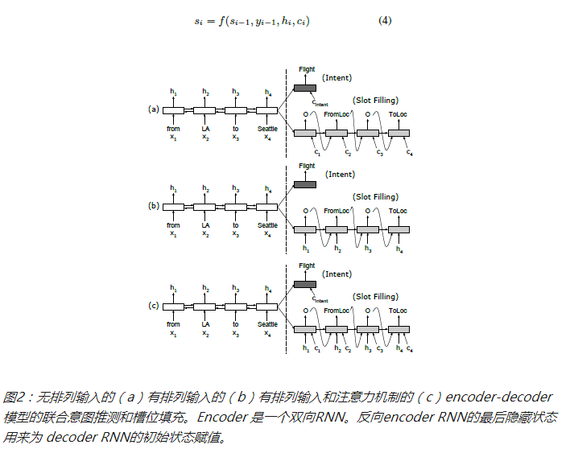

# 意图识别和槽填充

Joint model for intent detection and slot filling based on attention, input alignment and knowledge.

with ability to detect whether a input sentence is a noise input or meanfuling input by combine feature from domain detection, intent detection and slot filling.

with ability to assign possibility to a input sentence by using language model.

Introduction:
-------------------------------------------------------------------------------------
1.intent detection and slot filling joint model which share encoding information

2.incorporate knowledge information with embedding for both intent detection and slot filling. this embedding share the same embedding space with slots output.

3.use bi-direction RNN and CNN to do intent detection

4.use slots middle output as a feature for intent detection to boost performance

5.domain detection is availabile by using CNN, same structure as intent detection. domain is a high level concept which indicates 
area that intent(s) belongs to.

6.similiarity module is used to detect most similiar training data for any user input

7.toy task: input a sequence of natural number, such as [5,7,2,6,8,3].
for slot filling: count label each number to 0 or 1. if sum of a number together with its previous and next number is great than a threshold(such as 14), we mark it as 1. otherwise 0.
in this case, output of slot filling will be:[0,0,1,1,1,0]
for intent detection, count how many number totally is marked as 1. in this case, output of intent will be:3.

# 技术实现(意图识别归结为一个分类问题)
   1、正则库
   
   2、深度学习模型
   
# Model

Performance:
-------------------------------------------------------------------------------------

dataset1:
|---slot_naive(V6)|---slot_alime(V7)----------|

|------97.9%------|----99.8%%-----------------|

dataset2:

|---intent_tmall|---intent_tmall(similiarity)|---intent_alime|---intent_alime(similiarity)|---TextCNN---|---TextCNN(similiarity)|

|------95.37%|------72.0%-----------------|----93.0%------|----62.9%-----------------|----95.70%-------|----73.5%-------------|

Usage:
-------------------------------------------------------------------------------------
1.train the model: train() of xxx_train.py

2.test the model: predict() of xxx_predict.py

3. for model structure, you can check xxx_model.py

Description for different versions:
-------------------------------------------------------------------------------------
V0 (seq2seq version): use TextCNN for intent, use encoder-decoder(seq2seq) model for slots. train() and predict() for toy task is available under a1_joint_intent_slots_model.py

-----------------------------
V1 (naive version): 

use bi-directional GRU to encode input. this is share between intent detection and slots filling.

intent was predicted directically after fully connected layer based on sum up for different time step. 

slots were predicted directically after fully connected layer for each time step.

-----------------------------
V2 (simple version): 
add knowledge to naive version. knowledge is embedding, and used as additional feature to make prediction both for intent and slots.

-----------------------------

V3 (p-BOW,TextCNN,similiarity module): 

use positional bag of words to encoder input sentence. this is share between intent detection and slots filling.

TextCNN is used for intent detection. knowlege is embedded, transformed and used as feature together with output of TextCNN to make 

a prediction.

similiarity module is used to detect the most similiar question for input sentence. it used the representation learned by positional 

bag of words. this module is useful when you want to check similiar question or when you want to know the coverage of your dataset;

you can get a prediction by simply use the intent(or called answer) for the most similiar question of the input sentence.

-----------------------------

V4(Ali me style TextCNN):
word embedding is concated with knowledge embedding to get better representation for each word. 'Hopefully' to capture additional 

infomration that is relevant to make prediction. 

other part is same as V3

-----------------------------

V5(TextCNN):

just to make a comparision with V4 by not using any knowledge.

-----------------------------

V6(+domain version)

domain detection is predicted besides intent detection and slot filling.

-----------------------------

V7(+context window for slot filling)

mainly change slot filling part: 1.word vector+symbol vector 2.context window 3.nolinear projection 4.bi-directional lstm

for intent and domain detection, use representation from concat of word vector and symbol vector.

-----------------------------
V8(intent condition on domain; slot filling condition on intent)

given a domain, intent is limit to a subset of total intents; given a intent, slot name is limited to a subset of total slot names. this model doing this

by providing hidden states of domain together with other features before doing intent detection; it works similiar for slot filling.

-----------------------------

Conclude:
-------------------------------------------------------------------------------------
Different models can be used for intent detection and slots filling. Some model's performance is strong than others in some dataset, while other model's peformance is better in other dataset. So we need to do experiment using different model to get a better performance.

Reference:
-------------------------------------------------------------------------------------
1.Attention-Based Recurrent Neural Network Models for Joint Intent Detection and Slot Filling,

https://arxiv.org/pdf/1609.01454.pdf

2.阿里AI Labs王刚解读9小时卖出百万台的“天猫精灵” | 高山大学（GASA）,

http://www.sohu.com/a/206109679_473283

3.史上最全！阿里智能人机交互的核心技术解析 
https://yq.aliyun.com/articles/277907?spm=5176.100244.teamhomeleft.54.SKEyCU
