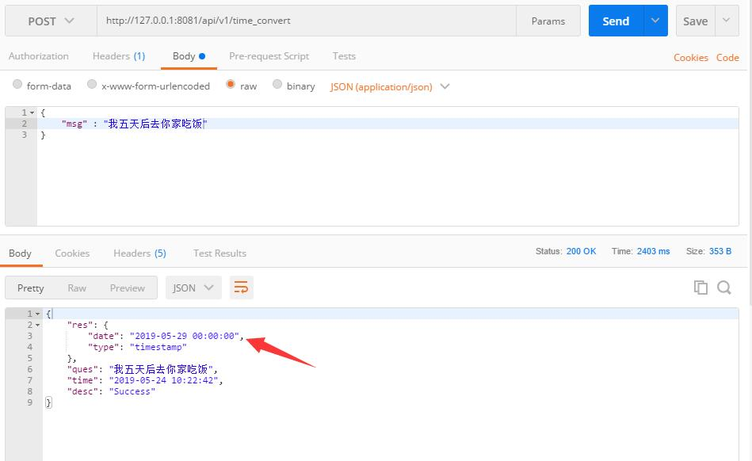

## 用于句子中时间词的抽取和转换

## 功能说明
用于句子中时间词的抽取和转换  
详情请见test.py

    res = tn.parse(target=u'过十分钟') # target为待分析语句，timeBase为基准时间默认是当前时间
    print(res)
    res = tn.parse(target=u'2013年二月二十八日下午四点三十分二十九秒', timeBase='2013-02-28 16:30:29') # target为待分析语句，timeBase为基准时间默认是当前时间
    print(res)
    res = tn.parse(target=u'我需要大概33天2分钟四秒', timeBase='2013-02-28 16:30:29') # target为待分析语句，timeBase为基准时间默认是当前时间
    print(res)
    res = tn.parse(target=u'今年儿童节晚上九点一刻') # target为待分析语句，timeBase为基准时间默认是当前时间
    print(res)
    res = tn.parse(target=u'2个小时以前') # target为待分析语句，timeBase为基准时间默认是当前时间
    print(res)
    res = tn.parse(target=u'晚上8点到上午10点之间') # target为待分析语句，timeBase为基准时间默认是当前时间
    print(res)
返回结果：

    {"timedelta": "0 days, 0:10:00", "type": "timedelta"}
    {"timestamp": "2013-02-28 16:30:29", "type": "timestamp"}
    {"type": "timedelta", "timedelta": {"year": 0, "month": 1, "day": 3, "hour": 0, "minute": 2, "second": 4}}
    {"timestamp": "2018-06-01 21:15:00", "type": "timestamp"}
    {"error": "no time pattern could be extracted."}
    {"type": "timespan", "timespan": ["2018-03-16 20:00:00", "2018-03-16 10:00:00"]}
    

## RESTful API调用
传入参数一个json格式的字符串，具体调用方式请参看接口文档

## 优化说明
    1、需将时间精确到小时 
    2、时间段问题。例如：我明天回家，后天去你家吃饭。   

## TODO