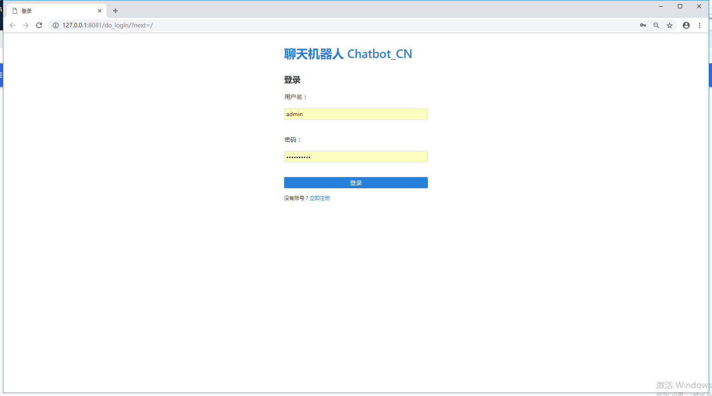
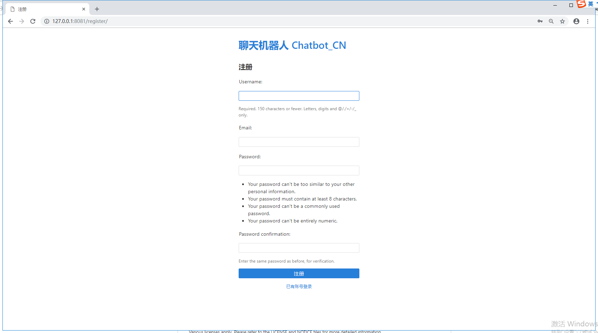
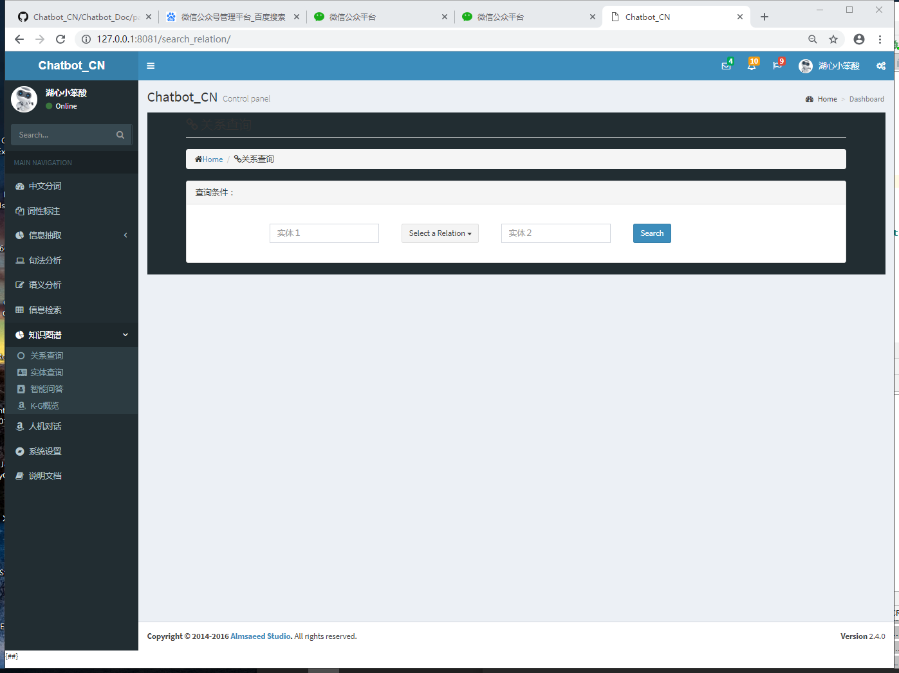
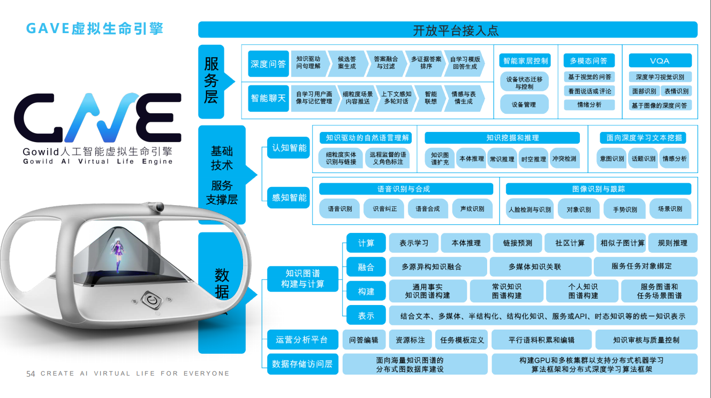
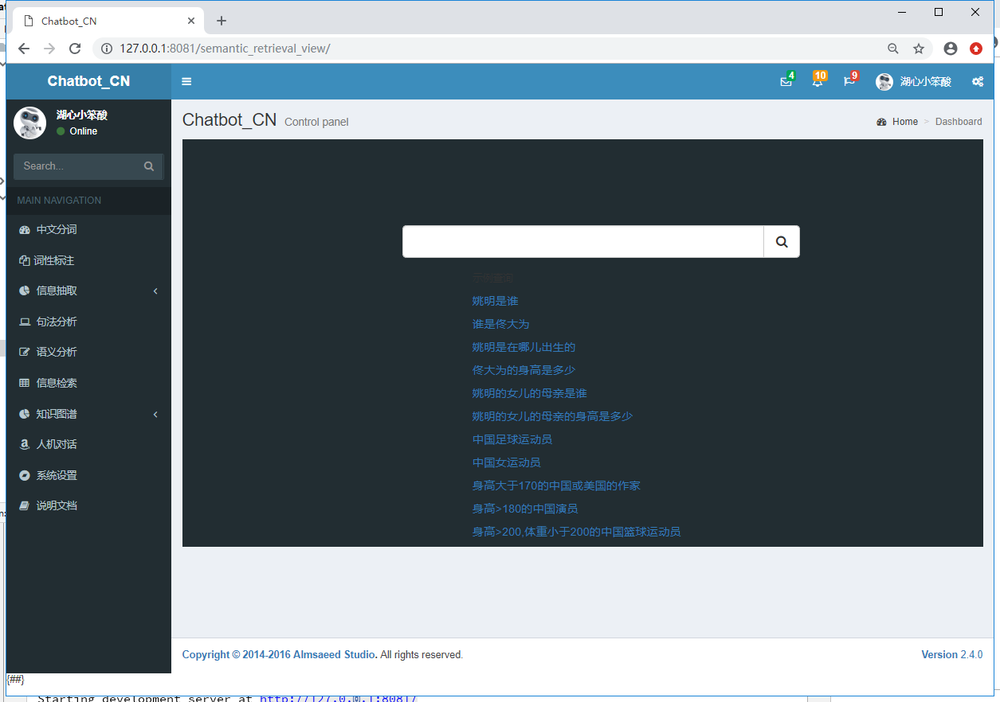
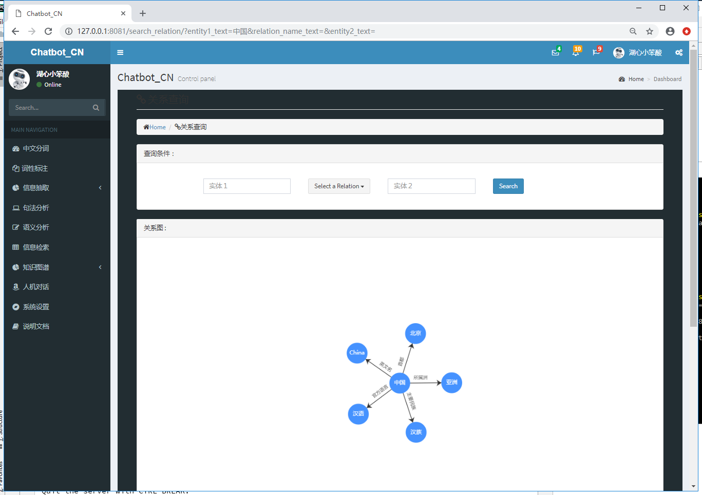
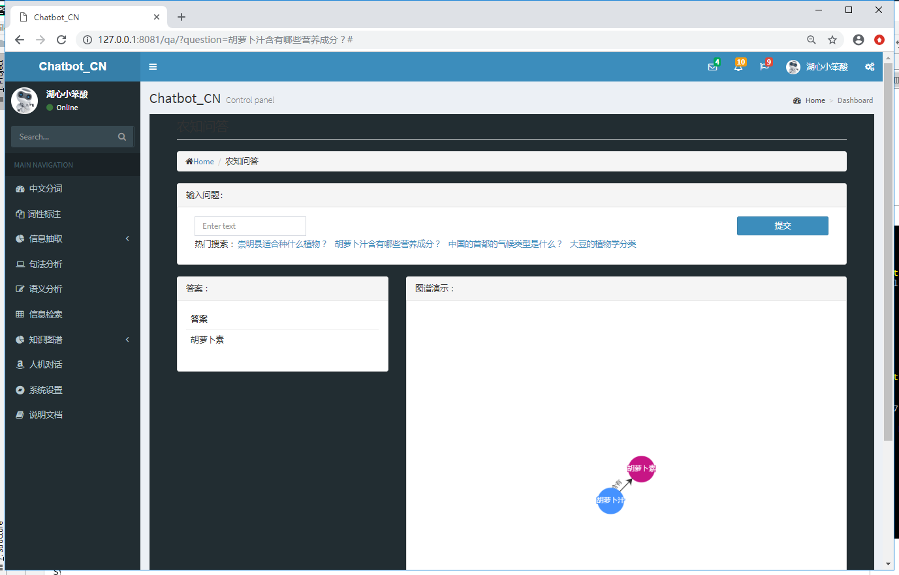
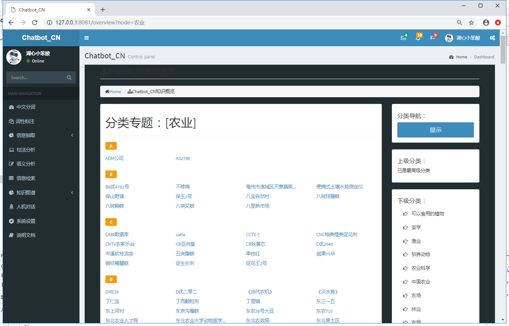

# Chatbot_CN  (www.chatbotcn.com)

#### 项目介绍(Chatbot_CN)
该项目的目的为实现闲聊的聊天机器人，目前的领域主要针对金融领域

项目共分为七个模块，具体介绍可参照各模块目录下README文件：

    Chatbot_CN       存放项目的整理配置文件
    Chatbot_Data     存放项目的数据文件以及模型训练文件
    Chatbot_Doc      存放项目的参考文献、笔记、收集的资料等文档文件
    Chatbot_Model    项目的模型实现
    Chatbot_KG       知识图谱实现
    Chatbot_Web      页面展示
    Chatbot_Rest     RESTful接口模块 (Chatbot_Rest/README.md)


#### 项目结构图

```
Chatbot_CN
├───Chatbot_CN  主要存放项目主体的配置文件
│   ├───data (内部实验数据)
│   │   ├───Attention-Based-BiLSTM-relation-extraction
│   │   ├───Info-extra
│   │   ├───lecture_2
│   │   ├───NRE
│   │   ├───pos-tagging
│   │   ├───QA
│   │   └───Relation_extraction
│   ├───example
│   │   ├───Attention-Based-BiLSTM-relation-extraction
│   │   ├───glove
│   │   ├───Info-extra
│   │   ├───lecture_1
│   │   ├───lecture_2
│   │   ├───lecture_3
│   │   ├───lecture_4
│   │   ├───NER
│   │   ├───NLP
│   │   ├───NRE
│   │   ├───POS-tagging
│   │   ├───Relation Extraction
│   │   ├───RL
│   │   ├───Sequence_labeling
│   │   ├───Synonyms
│   │   ├───syntactic
│   │   └───Syntactic_Parsing
│   ├───jieba_dict
│   ├───log
│   ├───QuestionAnswering
│   ├───RuleMatcher
│   ├───task_modules
│   ├───util
│   └───Validation
├───Chatbot_Data 主要存放数据文件及训练好的模型
├───Chatbot_Doc  主要存放一些文档，paper，笔记等文档文件
│   ├───cs224n
│   ├───note
│   ├───paper   （paper目录）
│   │   ├───Attention
│   │   ├───Co-reference Resolution
│   │   ├───DeepDive
│   │   ├───Dialogue System
│   │   ├───Distant-Supervision
│   │   ├───Entity Alignment
│   │   ├───Entity Disambiguation
│   │   ├───Entity Linking
│   │   ├───Info-Extra
│   │   │   ├───entity extraction
│   │   │   ├───event extraction
│   │   │   ├───relation extraction
│   │   │   └───terminology extraction
│   │   ├───Intent Detection
│   │   ├───kg    知识图谱
│   │   ├───KG Embeddings
│   │   ├───Knowledge Base Completion
│   │   ├───mulDialogue
│   │   ├───NER
│   │   ├───NLG
│   │   ├───nlp
│   │   ├───NLU
│   │   ├───Pinyin2Chinese
│   │   ├───QA
│   │   ├───Representation-Learning
│   │   ├───RL           强化学习
│   │   ├───RL In Dialogue
│   │   ├───Semantic Parsing
│   │   ├───Semantic Role Labeling
│   │   ├───Sentiment-Analyse
│   │   ├───Seq2Seq
│   │   ├───Shortest Dependency Path
│   │   ├───Slot Filling
│   │   ├───Syntax parsing
│   │   ├───Textual Entailment
│   │   ├───WordRepresentation
│   │   └───因果推断
│   ├───pic
│   ├───小象Chatbot课件
│   └───知识图谱课件
├───Chatbot_KG   知识图谱
├───Chatbot_Model   整个项目的模型实现
└───output

```

#### 安装教程

    1、项目的依赖包请参考Chatbot_CN根目录下的requirement.txt文件。
    2、1、导入sql文件到mysql，mysql数据主要作用为项目数据表，如用户注册、登录等。sql脚本文件上传在Chatbot_Data/DATA目录下，运行项目前需要将数据导入到mysql数据库，否则会启动报错
       步骤：1、在Chatbot_CN目录下修改settings.py文件里的数据库配置
            2、执行sql脚本，将数据导入到本地
    3、导入数据到Neo4J，Neo4j为支持知识图谱的图数据库查询，数据也存放在Chatbot_Data/DATA目录下。
       步骤：1、启动图数据库，将数据复制到import目录下
            2、导入。图数据库的部分教程以及数据的导入命令，关系查询构建请移步：Chatbot_Doc/图数据库  目录下
            3、修改项目中的Neo4j连接。文件位置在：Chatbot_KG/util下，neo_models.py
            4、启动图数据库。启动命令为： neo4j.bat console   （win环境下）
    4、启动sparql。对项目启动可选        
    
    
#### 项目架构
    
    
#### 項目展示
登錄頁

註冊頁

首页

模型（参考图）

SPARQL查询

信息检索


#### 知识图谱模块
关系查询

问答

概览


#### 演示
1、闲聊部分


2、任务型


#### 备注
    1、各个模块的说明请参考各个模块下的README文件
    2、代码会有一些冗余，不是所有代码在Chatbot运行流程中都会用上，有一些代码供学习用
    3、目前正在封装接口，这样可以将Chatbot_Model 和 Chatbot_KG模块全部以RESTful api形式对外开放，提供远程调用。


#### 有关paper代码复现请关注另一个开源项目：
https://github.com/charlesXu86/PAPER-In-CODE

#### 博客 ：https://blog.csdn.net/Q_S_Y_Q

#### 知乎专栏：聊天机器人开发实战

#### QQ群： [聊天机器人开发实战](点击链接加入群聊【聊天机器人开发实战】：https://jq.qq.com/?_wv=1027&k=5ypCd1S) (718607564)

#### 微信公众号： 聊天机器人开发实战

#### 域名：www.chatbotcn.com (目前尚未部署)

#### 说明
持续更新中。。。


#### Referrence
    OpenKE
    OpenNRE

License(s)
----------
Various licenses apply. Please refer to the LICENSE and NOTICE files for more
detailed information.